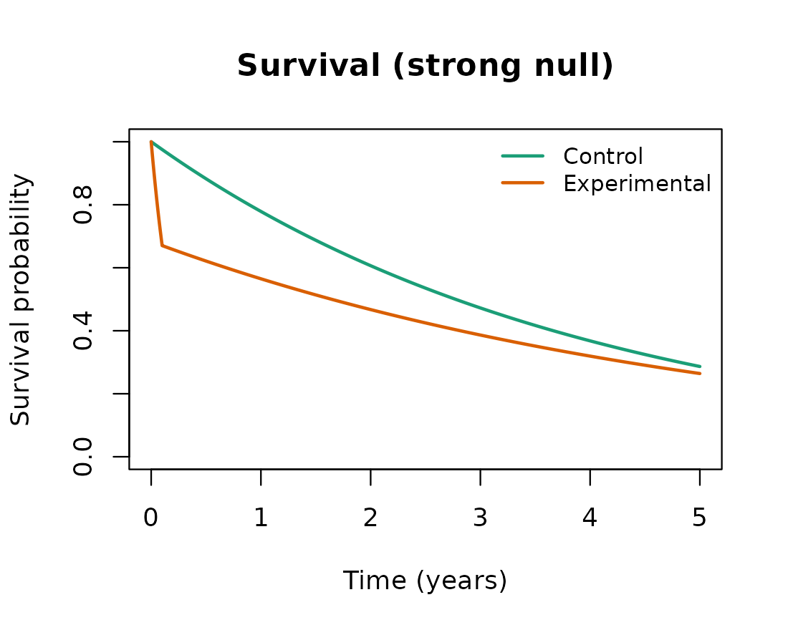

# Investigating the Freidlin and Korn strong null scenario

## Overview

Weighted log-rank tests and the MaxCombo test gain power by emphasizing
the part of the follow-up where the treatment effect is expected to
appear. Freidlin and Korn (2019) caution that this same emphasis can be
a liability: a test that down-weights early events can declare the
experimental arm superior even when that arm is uniformly worse, because
a late portion of the survival curves where the experimental hazard
happens to be lower is allowed to dominate the test statistic. This
vignette reproduces the strong null scenario they use to make that
point. To keep the comparison interpretable, it also includes the weak
null in which the two arms are identical, so that the behavior under the
strong null can be read against a baseline in which every method is
valid. In the terminology of Magirr and Burman (2019), the weak null is
the hypothesis of equal survival functions, while the strong null is the
hypothesis that the experimental arm is no better than the control arm
at any time point; the scenario of an experimental arm that is uniformly
worse is one point in this strong null.

``` r

library(FastSurvival)
```

## The two scenarios

Both scenarios share a control arm with a constant hazard of 0.25 per
year. In the weak null the experimental arm is identical to the control
arm. In the strong null the experimental arm has a very large hazard for
a short initial period (early harm) and a slightly lower hazard
thereafter; the parameters follow the Freidlin and Korn (2019) example
as implemented in the `simtrial` package documentation, namely an
experimental hazard ratio of 16 for the first 0.1 year followed by 0.76
afterwards. The analysis is at 5 years.

``` r

e_time <- c(0, 0.1, Inf)         # change point at 0.1 year
cut    <- 5                      # analysis at 5 years

scenarios <- list(
  equal = list(
    label = "Equal survival (weak null)",
    haz_c = c(0.25, 0.25), haz_e = c(0.25, 0.25)),
  strong = list(
    label = "Experimental uniformly worse (strong null)",
    haz_c = c(0.25, 0.25), haz_e = c(16, 0.76) * 0.25)
)
```

The decisive feature of the strong null is that the experimental
survival curve lies below the control curve for the whole of the
follow-up. The brief but extreme early hazard drops the experimental
survivors far enough that the modestly lower hazard afterwards never
lets them catch up. The hazard ratio, however, falls below one after the
first 0.1 year, and it is this late region that late-emphasis tests
reward.



The experimental arm is worse at every time point on the survival scale,
even though its hazard is lower than the control hazard after the first
0.1 year.

## Methods compared

Four methods are compared. The unweighted log-rank test weights all
events equally. The Fleming-Harrington FH(0,1) weighted log-rank test
up-weights late events and is the test most directly affected by the
concern raised above. The MaxCombo test takes the most significant of a
set of Fleming-Harrington components, so it inherits the behavior of its
late-emphasis members. The modestly-weighted log-rank test of Magirr and
Burman (2019) also up-weights late events, but it caps the weight so
that no single region can dominate, which is intended to prevent exactly
the kind of spurious rejection at issue here.

A single simulated data set is reused across the methods. The weighted
log-rank tests each occupy the `logrank.*` columns, so they are obtained
from separate `analysis_fast` calls; the analysis is a calendar-time cut
at 5 years and testing is one-sided in the direction of experimental
benefit.

``` r

NSIM    <- 2000L     # raise (e.g. 5000) for tighter Monte Carlo error
N_TOTAL <- 2000L
ALPHA   <- 0.025
SIDE    <- 1L
T_STAR  <- 0.5       # modestly-weighted log-rank delay (years)
SEED    <- 20240601L

run_one_scenario <- function(scn) {
  dataset <- simdata_fast(
    nsim     = NSIM,
    n        = rep(N_TOTAL %/% 2L, 2L),
    a.time   = c(0, 1e-4),       # near-instantaneous enrollment
    a.prop   = 1,
    e.hazard = list(scn$haz_c, scn$haz_e),
    e.time   = e_time,
    seed     = SEED
  )

  res_lr   <- analysis_fast(dataset, control = 1, time.looks = cut,
                            stat = "logrank", side = SIDE)
  res_fh01 <- analysis_fast(dataset, control = 1, time.looks = cut,
                            stat = "logrank", weight = "fh",
                            rho = 0, gamma = 1, side = SIDE)
  res_mb   <- analysis_fast(dataset, control = 1, time.looks = cut,
                            stat = "logrank", weight = "mwlrt",
                            t_star = T_STAR, side = SIDE)
  res_mc   <- analysis_fast(dataset, control = 1, time.looks = cut,
                            stat = "maxcombo",
                            mc.rho = c(0, 0, 1, 1), mc.gamma = c(0, 1, 0, 1),
                            side = SIDE)

  reject_in_favor <- function(res, pcol) {
    ok <- res$reached
    mean(res[[pcol]][ok] <= ALPHA, na.rm = TRUE)
  }
  c("Log-rank"          = reject_in_favor(res_lr,   "logrank.p"),
    "FH(0,1)"           = reject_in_favor(res_fh01, "logrank.p"),
    "Modestly weighted" = reject_in_favor(res_mb,   "logrank.p"),
    "MaxCombo"          = reject_in_favor(res_mc,   "maxcombo.p"))
}
```

## Results

The reported quantity is the one-sided rejection rate in favor of the
experimental arm. Under the weak null the two arms are identical, so
this is the ordinary one-sided type I error rate and every valid test
should be near 2.5%. Under the strong null the experimental arm is
uniformly worse, so a test that respects the survival ordering should
keep the rate at or below 2.5%; a rate well above 2.5% means the test is
declaring a harmful treatment beneficial.

``` r

rates <- vapply(scenarios, run_one_scenario, numeric(4L))
colnames(rates) <- vapply(scenarios, function(s) s$label, character(1L))
round(rates, 3)
#>                   Equal survival (weak null)
#> Log-rank                               0.028
#> FH(0,1)                                0.026
#> Modestly weighted                      0.028
#> MaxCombo                               0.024
#>                   Experimental uniformly worse (strong null)
#> Log-rank                                               0.000
#> FH(0,1)                                                0.610
#> Modestly weighted                                      0.000
#> MaxCombo                                               0.516
```

|  | Equal survival (weak null) | Experimental uniformly worse (strong null) |
|:---|---:|---:|
| Log-rank | 0.028 | 0.000 |
| FH(0,1) | 0.026 | 0.610 |
| Modestly weighted | 0.028 | 0.000 |
| MaxCombo | 0.024 | 0.516 |

One-sided rejection rate in favor of the experimental arm (2000
simulated trials, n = 2000). Under the weak null every valid test is
near 2.5%; under the strong null the experimental arm is uniformly
worse, so a rate above 2.5% reflects a spurious finding. {.table}

## Interpretation

Under the weak null all four methods sit near the nominal 2.5%,
confirming that each is a valid one-sided test when the survival curves
are equal. The contrast appears under the strong null. The unweighted
log-rank test keeps the rejection rate in favor of the experimental arm
near zero: it weights the early harm and the late separation in
proportion to the events occurring at each, so the early harm offsets
the late region and the test correctly almost never favors the worse
arm. The FH(0,1) test and the MaxCombo test instead reject in favor of
the experimental arm at a high rate, because down-weighting the early
events removes the evidence of harm and lets the late region drive the
result. This is the behavior Freidlin and Korn (2019) warn against: a
statistically significant result in favor of a treatment that is, by
construction, never better on the survival scale. The modestly-weighted
log-rank test of Magirr and Burman (2019) behaves like the log-rank test
here, since capping the weights prevents the late region from
dominating, which is why it remains a useful member of the weighted
family even when unbounded late-emphasis tests do not.

None of this means that emphasizing late events is never appropriate.
Freidlin and Korn (2019) note that a test down-weighting early events
can be justified when it is known in advance that the intervention
cannot affect early outcomes, as in some screening and prevention
trials, and they regard methods for non-proportional hazards as useful
secondary analyses. The caution is specific: when the survival ordering
is not known in advance, a primary analysis built on a late-emphasis
test can convert a clinically meaningless or harmful pattern into a
significant result, whereas a log-rank-based primary analysis is robust
to this failure.

## Notes

The strong null parameters follow the Freidlin and Korn (2019) example
as given in the `simtrial` package documentation. The modestly-weighted
log-rank delay `T_STAR` and the number of simulated trials `NSIM` are
set at the top of the design chunk and can be changed; `NSIM` is kept
modest so the vignette builds quickly, and a larger value tightens the
Monte Carlo error on the reported rates.

## References

Freidlin, B., & Korn, E. L. (2019). Methods for accommodating
nonproportional hazards in clinical trials: Ready for the primary
analysis? *Journal of Clinical Oncology*, 37(35), 3455-3459.

Magirr, D., & Burman, C.-F. (2019). Modestly weighted logrank tests.
*Statistics in Medicine*, 38(20), 3782-3790.
