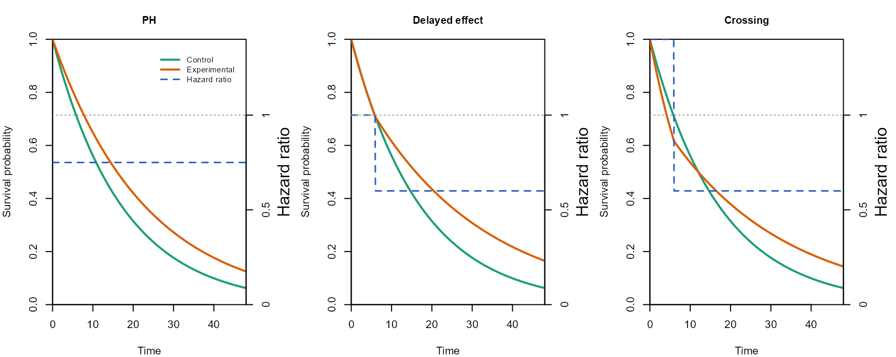
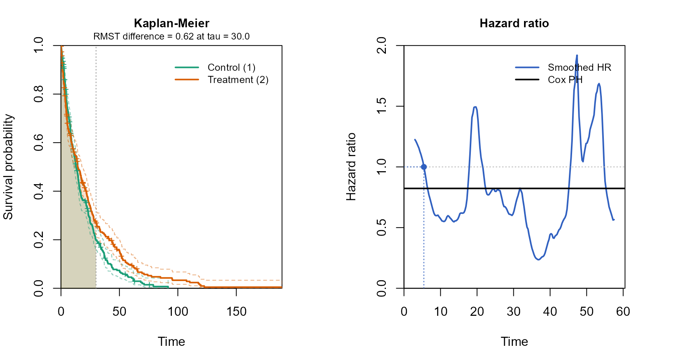

# Comparing the log-rank test and RMST under nonproportional hazards

This vignette uses the simulation trio (`simdata_fast`, `analysis_fast`,
and `simsummary_fast`) to compare the power of the log-rank test and the
restricted mean survival time (RMST) at a single fixed analysis, under
three survival patterns: proportional hazards, a delayed treatment
effect, and crossing hazards. Along the way it shows the two plotting
layers of the package, the design-stage scenario plot from
`gen_scenario_fast` and the analysis-stage Kaplan-Meier plot from
`kmcurve_fast`.

The log-rank test is the most efficient test when hazards are
proportional, but its power can fall under nonproportional hazards
because it weights all event times equally. RMST contrasts the area
under the survival curves up to a truncation time and summarizes a
difference in survival rather than a hazard ratio, so it behaves
differently when the treatment effect is concentrated late or reverses
over time. The three scenarios below are chosen to make those
differences visible at a common sample size.

## Design and sample size

The control group has a median survival of 12 months. The sample size is
set so that the proportional-hazards scenario, with a hazard ratio of
0.75, has 90% power at a one-sided 0.025 level. The events are obtained
from the Schoenfeld formula and inflated to a sample size with the
Lachin-Foulkes method through
[`gsDesign::nSurv`](https://keaven.github.io/gsDesign/reference/nSurv.html),
given 12 months of accrual, 36 months of minimum follow-up, and a 5%
annual dropout. The same sample size is then applied unchanged to all
three scenarios.

``` r
m0             <- 12
lam0           <- log(2) / m0
hr_ph          <- 0.75
hr_late        <- 0.60
hr_early_cross <- 1.40
delay          <- 6
alpha          <- 0.025
power_target   <- 0.90
accrual        <- 12
minfup         <- 36
study_dur      <- accrual + minfup
dropout_annual <- 0.05
eta            <- -log(1 - dropout_annual) / 12
tau            <- 30

ns <- gsDesign::nSurv(
  lambdaC = lam0, hr = hr_ph, eta = eta,
  T = study_dur, minfup = minfup,
  alpha = alpha, beta = 1 - power_target, sided = 1, ratio = 1
)
n_per   <- ceiling(ns$n / 2)
n       <- c(n_per, n_per)
n_total <- sum(n)
a_rate  <- n_total / accrual
```

``` r
data.frame(
  "Total n"       = n_total,
  "Per group"     = n_per,
  "Target events" = round(ns$d),
  check.names = FALSE
)
#>   Total n Per group Target events
#> 1     616       308           506
```

## Scenarios

The control group is exponential throughout. The treatment group differs
by scenario. Under proportional hazards the treatment hazard is 0.75
times the control hazard at all times. Under the delayed effect the two
groups share the same hazard for the first 6 months and the treatment
hazard drops to 0.60 times the control thereafter. Under crossing
hazards the treatment group has a higher hazard for the first 6 months
and a lower hazard afterwards, so the survival curves cross. The
design-stage scenario plot shows the assumed survival curves and the
piecewise hazard ratio for each scenario.

``` r
scn <- gen_scenario_fast(
  scenarios = list(
    "PH" = list(
      e.hazard = list(lam0, hr_ph * lam0)
    ),
    "Delayed effect" = list(
      e.hazard = list(lam0, c(lam0, hr_late * lam0)),
      e.time   = c(0, delay, Inf)
    ),
    "Crossing" = list(
      e.hazard = list(lam0, c(hr_early_cross * lam0, hr_late * lam0)),
      e.time   = c(0, delay, Inf)
    )
  ),
  shared = list(n = n, a.time = c(0, accrual), a.rate = a_rate)
)

plot(scn, tmax = study_dur, mfrow = c(1, 3))
```



## A single simulated trial

Passing each scenario object to `simdata_fast` generates the data, here
`nsim` replicates per scenario. The Kaplan-Meier plot below uses one
replicate of the crossing scenario and adds the smoothed time-varying
hazard ratio and the RMST shading up to the truncation time, which makes
the early reversal of the effect visible in a single realized trial.

``` r
scenarios <- scn$scenarios
seeds     <- c(101, 102, 103)

power_tab <- data.frame(
  Scenario = character(0), LogRank = numeric(0), RMST = numeric(0),
  stringsAsFactors = FALSE
)
examples <- vector("list", length(scenarios))
names(examples) <- names(scenarios)

for (i in seq_along(scenarios)) {
  s   <- scenarios[[i]]
  dat <- do.call(
    simdata_fast,
    c(s$args, list(nsim = nsim, d.hazard = eta, seed = seeds[i]))
  )
  res <- analysis_fast(
    dat, control = 1,
    time.looks = study_dur,
    stat = c("logrank", "rmst"),
    tau = tau, side = 1
  )
  s_lr   <- simsummary_fast(res, p.col = "logrank.p", alpha = alpha)
  s_rmst <- simsummary_fast(res, p.col = "rmst.p",    alpha = alpha)
  power_tab <- rbind(power_tab, data.frame(
    Scenario = s$label,
    LogRank  = s_lr[s_lr$look   == "overall", "cum.reject"],
    RMST     = s_rmst[s_rmst$look == "overall", "cum.reject"],
    stringsAsFactors = FALSE
  ))
  examples[[i]] <- dat[dat$sim == 1L, c("tte", "event", "group")]
}
```

``` r
ex  <- examples[["Crossing"]]
fit <- kmcurve_fast(ex$tte, ex$event, ex$group, control = 1)
plot(fit, hr = TRUE, rmst = TRUE, tau = tau, bw = 3)
```



## Power comparison

The table reports the simulated power, the proportion of the 10000
replicates in which each test rejects at the one-sided 0.025 level, for
each scenario.

``` r
knitr::kable(
  power_tab, digits = 3,
  col.names = c("Scenario", "Log-rank", "RMST"),
  caption = "Simulated power at the fixed analysis (one-sided 0.025)."
)
```

| Scenario       | Log-rank |  RMST |
|:---------------|---------:|------:|
| PH             |    0.901 | 0.839 |
| Delayed effect |    0.952 | 0.748 |
| Crossing       |    0.435 | 0.086 |

Simulated power at the fixed analysis (one-sided 0.025).

Under proportional hazards the log-rank test reaches its design power
and RMST is somewhat lower, as expected when the hazard ratio is
constant and the log-rank test is the efficient choice. The two
nonproportional scenarios are governed by the truncation time, because
the treatment benefit accrues only after the delay and RMST can detect
it only over a window that spans the separation. Under the delayed
effect the late effect is strong, so the log-rank test stays powerful,
while RMST recovers more signal as the window lengthens. Under crossing
hazards the early reversal cancels much of the late benefit on the
hazard scale, so the log-rank test loses power; RMST summarizes the net
survival difference over the window, which here stays modest because the
early harm offsets part of the later gain. The single-trial plot above
shows the mechanism: the smoothed hazard ratio crosses one within the
follow-up window, the situation in which a single hazard-ratio summary
is least informative. The table reports the power that results from
these mechanisms at the chosen truncation time.

The truncation time for RMST is set here to 30 months, within the
minimum follow-up of 36 months, so that every subject contributes over
the window without extrapolation. The truncation time has a strong
effect on the RMST result: a window that ends before the treatment
benefit has accumulated leaves RMST little to detect, so it must be long
enough to span the separation, and it should be prespecified on clinical
grounds rather than tuned to the data.
